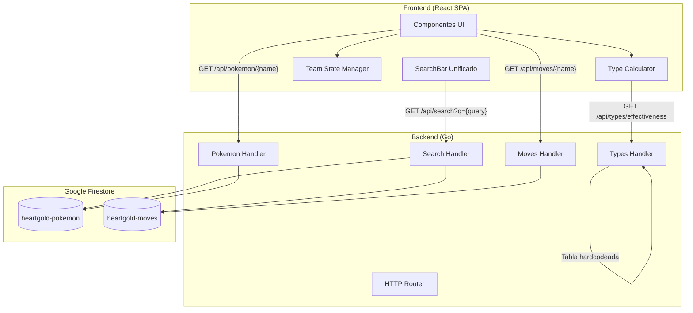

# Diseño: Pokémon Team Builder (HeartGold/SoulSilver)

## Visión General

El Pokémon Team Builder es una aplicación web que extiende el backend Go existente con nuevos endpoints y añade un frontend en React para permitir a los jugadores construir equipos de hasta 6 Pokémon, asignar movimientos y obtener análisis de cobertura de tipos y debilidades. El frontend incluye un buscador unificado que permite buscar Pokémon por nombre, tipo o movimiento desde un único campo de búsqueda. Todo el estado del equipo se gestiona en el cliente (sin persistencia en servidor), mientras que el backend sirve datos de Pokémon y movimientos desde Firestore.

### Decisiones de Diseño Clave

1. **Estado del equipo en el cliente**: El equipo se gestiona enteramente en el frontend con React state. No se requiere autenticación ni persistencia en servidor para esta versión.
2. **Tabla de tipos hardcodeada**: La tabla de efectividad de tipos Gen IV se implementa como una constante en el backend (paquete `typeeffectiveness`) y se expone vía API, evitando dependencias externas para cálculos críticos.
3. **Cálculos de cobertura en el frontend**: Los cálculos de cobertura ofensiva y debilidades defensivas se realizan en el frontend usando la tabla de tipos obtenida del backend, permitiendo recálculo inmediato sin latencia de red.
4. **Filtrado de movimientos por version group**: Los movimientos disponibles para un Pokémon se filtran por `version_group_details` donde `version_group.name == "heartgold-soulsilver"`.

## Arquitectura



### Flujo de Datos

1. El frontend carga la lista completa de Pokémon al iniciar (`GET /api/pokemon`) para mostrar la vista inicial
2. El frontend carga la tabla de efectividad de tipos una vez (`GET /api/types/effectiveness`) y la cachea
3. El usuario escribe en el buscador unificado → se llama a `GET /api/search?q={query}` que busca por nombre, tipo y movimiento simultáneamente
4. El usuario selecciona un Pokémon de los resultados → se obtiene detalle (`GET /api/pokemon/{name}`)
5. El usuario asigna movimientos → se obtiene detalle de cada movimiento (`GET /api/moves/{name}`)
6. El frontend recalcula cobertura y debilidades localmente cada vez que cambia el equipo

## Componentes e Interfaces

### Backend - Nuevos Endpoints

#### GET /api/search?q={query}

Endpoint de búsqueda unificada. Busca el query contra nombres de Pokémon, tipos y nombres de movimientos. Retorna resultados agrupados por categoría.

**Query Parameters:**

- `q` (requerido): Texto de búsqueda (mínimo 2 caracteres)

**Response 200:**

```json
{
  "query": "fire",
  "results": {
    "by_name": [
      {
        "id": 136,
        "name": "flareon",
        "regional_id": 188,
        "types": [{ "slot": 1, "type": { "name": "fire" } }],
        "sprites": { "front_default": "..." },
        "match_reason": "name"
      }
    ],
    "by_type": [
      {
        "id": 155,
        "name": "cyndaquil",
        "regional_id": 4,
        "types": [{ "slot": 1, "type": { "name": "fire" } }],
        "sprites": { "front_default": "..." },
        "match_reason": "type"
      }
    ],
    "by_move": [
      {
        "id": 25,
        "name": "pikachu",
        "regional_id": 22,
        "types": [{ "slot": 1, "type": { "name": "electric" } }],
        "sprites": { "front_default": "..." },
        "match_reason": "move",
        "matched_move": "fire-punch"
      }
    ]
  }
}
```

**Response 400:**

```json
{
  "error": "Query parameter 'q' is required and must be at least 2 characters"
}
```

**Lógica de búsqueda:**

1. **Por nombre**: Busca Pokémon cuyo nombre contenga el query (case-insensitive)
2. **Por tipo**: Si el query coincide exactamente con uno de los 17 tipos, retorna todos los Pokémon de ese tipo
3. **Por movimiento**: Busca movimientos cuyo nombre contenga el query, luego retorna los Pokémon que aprenden esos movimientos en HG/SS. Para esto, se itera sobre los Pokémon en Firestore y se verifica si tienen el movimiento en su lista de `moves` con `version_group_details` donde `version_group.name == "heartgold-soulsilver"`

#### GET /api/moves/{name}

Retorna los datos completos de un movimiento.

**Response 200:**

```json
{
  "name": "thunderbolt",
  "type": "electric",
  "power": 95,
  "accuracy": 100,
  "pp": 15,
  "damage_class": "special",
  "effect": "Has a 10% chance of paralyzing the target."
}
```

**Response 404:**

```json
{
  "error": "Move not found: thunder-puncha"
}
```

#### GET /api/types/effectiveness

Retorna la tabla completa de efectividad de tipos Gen IV.

**Response 200:**

```json
{
  "types": [
    "normal",
    "fire",
    "water",
    "electric",
    "grass",
    "ice",
    "fighting",
    "poison",
    "ground",
    "flying",
    "psychic",
    "bug",
    "rock",
    "ghost",
    "dragon",
    "dark",
    "steel"
  ],
  "chart": {
    "fire": {
      "grass": 2.0,
      "water": 0.5,
      "fire": 0.5,
      "ice": 2.0,
      "bug": 2.0,
      "steel": 2.0,
      "rock": 0.5,
      "dragon": 0.5
    }
  }
}
```

Solo se incluyen las entradas que difieren de 1.0 (daño neutral). Las combinaciones ausentes implican factor 1.0.

#### GET /api/pokemon/{name}/moves

Retorna los movimientos que un Pokémon puede aprender en HeartGold/SoulSilver.

**Response 200:**

```json
{
  "pokemon": "typhlosion",
  "moves": [
    {
      "name": "flamethrower",
      "type": "fire",
      "power": 95,
      "accuracy": 100,
      "pp": 15,
      "damage_class": "special",
      "learn_method": "machine",
      "level_learned_at": 0
    }
  ]
}
```

### Backend - Estructura de Paquetes

```
api/
  pokemon.go          (existente - se mantiene)
  search.go           (nuevo - handler de búsqueda unificada)
  moves.go            (nuevo - handler de movimientos)
  types.go            (nuevo - handler de tabla de tipos)
typeeffectiveness/
  chart.go            (nuevo - tabla de tipos Gen IV hardcodeada)
  chart_test.go       (nuevo - tests de la tabla)
```

### Frontend - Estructura de Componentes

```
frontend/
  src/
    components/
      SearchBar.tsx         - Buscador unificado (nombre, tipo, movimiento)
      SearchResults.tsx     - Resultados agrupados por categoría
      PokemonCard.tsx       - Tarjeta de Pokémon en los resultados
      PokemonDetail.tsx     - Detalle de un Pokémon (stats, habilidades)
      TeamPanel.tsx         - Panel del equipo (6 slots)
      TeamSlot.tsx          - Slot individual del equipo
      MoveSelector.tsx      - Selector de movimientos para un Pokémon
      MoveCard.tsx          - Tarjeta de un movimiento asignado
      CoverageChart.tsx     - Gráfico de cobertura ofensiva
      WeaknessChart.tsx     - Gráfico de debilidades defensivas
      TypeBadge.tsx         - Badge visual de un tipo
    hooks/
      useTeam.ts            - Hook para gestión del estado del equipo
      useSearch.ts          - Hook para la búsqueda unificada (debounce + llamada a API)
      useTypeChart.ts       - Hook para cargar y cachear la tabla de tipos
    utils/
      typeCalculator.ts     - Funciones puras de cálculo de efectividad
    types/
      pokemon.ts            - Tipos TypeScript
    App.tsx
```

### Frontend - Hook useTeam

```typescript
interface TeamSlot {
  pokemon: PokemonDetail | null;
  moves: MoveDetail[]; // máximo 4
}

interface UseTeamReturn {
  team: TeamSlot[]; // siempre 6 slots
  addPokemon: (pokemon: PokemonDetail) => boolean;
  removePokemon: (slotIndex: number) => void;
  addMove: (slotIndex: number, move: MoveDetail) => boolean;
  removeMove: (slotIndex: number, moveIndex: number) => void;
  isFull: boolean;
}
```

### Frontend - typeCalculator (funciones puras)

```typescript
type TypeChart = Record<string, Record<string, number>>;

// Calcula el multiplicador de un tipo atacante contra un Pokémon defensor (1 o 2 tipos)
function getEffectiveness(
  attackType: string,
  defenderTypes: string[],
  chart: TypeChart,
): number;

// Calcula cobertura ofensiva: para cada tipo defensor, cuántos movimientos del equipo son super efectivos
function calculateCoverage(
  team: TeamSlot[],
  chart: TypeChart,
): Record<string, number>;

// Calcula debilidades defensivas: para cada tipo atacante, cuántos Pokémon del equipo son débiles/resisten
function calculateWeaknesses(
  team: TeamSlot[],
  chart: TypeChart,
): Record<string, { weak: number; resist: number }>;
```

## Modelos de Datos

### Backend

#### MoveResponse (nuevo)

```go
type MoveResponse struct {
    Name        string  `json:"name"`
    Type        string  `json:"type"`
    Power       *int    `json:"power"`
    Accuracy    *int    `json:"accuracy"`
    PP          int     `json:"pp"`
    DamageClass string  `json:"damage_class"`
    Effect      string  `json:"effect"`
}
```

#### PokemonMovesResponse (nuevo)

```go
type PokemonMoveEntry struct {
    Name          string `json:"name"`
    Type          string `json:"type"`
    Power         *int   `json:"power"`
    Accuracy      *int   `json:"accuracy"`
    PP            int    `json:"pp"`
    DamageClass   string `json:"damage_class"`
    LearnMethod   string `json:"learn_method"`
    LevelLearnedAt int   `json:"level_learned_at"`
}

type PokemonMovesResponse struct {
    Pokemon string             `json:"pokemon"`
    Moves   []PokemonMoveEntry `json:"moves"`
}
```

#### TypeEffectivenessChart

```go
// En typeeffectiveness/chart.go
type Chart struct {
    Types []string                       `json:"types"`
    Data  map[string]map[string]float64  `json:"chart"`
}
```

#### SearchResponse (nuevo)

```go
type SearchMatchItem struct {
    ID         int    `json:"id"`
    Name       string `json:"name"`
    RegionalID int    `json:"regional_id"`
    Types      []struct {
        Slot int `json:"slot"`
        Type struct {
            Name string `json:"name"`
        } `json:"type"`
    } `json:"types"`
    Sprites struct {
        FrontDefault string `json:"front_default"`
    } `json:"sprites"`
    MatchReason  string `json:"match_reason"`
    MatchedMove  string `json:"matched_move,omitempty"`
}

type SearchResults struct {
    ByName []SearchMatchItem `json:"by_name"`
    ByType []SearchMatchItem `json:"by_type"`
    ByMove []SearchMatchItem `json:"by_move"`
}

type SearchResponse struct {
    Query   string        `json:"query"`
    Results SearchResults `json:"results"`
}
```

La tabla se define como un `map[string]map[string]float64` donde `Data[atacante][defensor] = multiplicador`. Solo se almacenan valores distintos de 1.0. La función `GetEffectiveness(attackType, defenseType string) float64` retorna el multiplicador (default 1.0 si no está en el mapa).

### Frontend (TypeScript)

```typescript
interface PokemonListItem {
  id: number;
  name: string;
  regional_id: number;
  types: { slot: number; type: { name: string } }[];
  sprites: { front_default: string };
}

interface PokemonDetail extends PokemonListItem {
  base_experience: number;
  height: number;
  weight: number;
  abilities: { ability: { name: string }; is_hidden: boolean }[];
  stats: { base_stat: number; stat: { name: string } }[];
  sprites: { front_default: string; back_default: string };
}

interface MoveDetail {
  name: string;
  type: string;
  power: number | null;
  accuracy: number | null;
  pp: number;
  damage_class: string;
  learn_method: string;
  level_learned_at: number;
}

interface TeamSlot {
  pokemon: PokemonDetail | null;
  moves: MoveDetail[];
}

interface TypeChart {
  types: string[];
  chart: Record<string, Record<string, number>>;
}

interface CoverageResult {
  [defenderType: string]: number; // cantidad de movimientos super efectivos
}

interface WeaknessResult {
  [attackerType: string]: { weak: number; resist: number };
}

interface SearchMatchItem {
  id: number;
  name: string;
  regional_id: number;
  types: { slot: number; type: { name: string } }[];
  sprites: { front_default: string };
  match_reason: "name" | "type" | "move";
  matched_move?: string;
}

interface SearchResponse {
  query: string;
  results: {
    by_name: SearchMatchItem[];
    by_type: SearchMatchItem[];
    by_move: SearchMatchItem[];
  };
}
```

### Tabla de Efectividad de Tipos - Generación IV

La tabla incluye los 17 tipos de Gen IV (Fairy no existe en esta generación). Las inmunidades clave:

| Atacante | Defensor | Factor |
| -------- | -------- | ------ |
| Normal   | Ghost    | 0      |
| Fighting | Ghost    | 0      |
| Ghost    | Normal   | 0      |
| Electric | Ground   | 0      |
| Ground   | Flying   | 0      |
| Psychic  | Dark     | 0      |
| Poison   | Steel    | 0      |

Para Pokémon con doble tipo, el factor final es el producto de los factores individuales. Ejemplo: un movimiento Electric contra Water/Flying = 2.0 × 2.0 = 4.0 (cuádruple efectividad).

## Propiedades de Correctitud

_Una propiedad es una característica o comportamiento que debe mantenerse verdadero en todas las ejecuciones válidas de un sistema — esencialmente, una declaración formal sobre lo que el sistema debe hacer. Las propiedades sirven como puente entre especificaciones legibles por humanos y garantías de correctitud verificables por máquinas._

### Propiedad 1: Búsqueda por nombre retorna solo coincidencias

_Para cualquier_ lista de Pokémon y _cualquier_ cadena de búsqueda, todos los Pokémon retornados en la categoría `by_name` deben tener un nombre que contenga la cadena de búsqueda (case-insensitive), y ningún Pokémon cuyo nombre contenga la cadena debe ser excluido del resultado.

**Valida: Requisitos 1.2**

### Propiedad 2: Búsqueda por tipo retorna solo Pokémon de ese tipo

_Para cualquier_ tipo seleccionado de los 17 tipos disponibles, todos los Pokémon retornados en la categoría `by_type` deben tener el tipo buscado como tipo primario o secundario, y ningún Pokémon que posea ese tipo debe ser excluido.

**Valida: Requisitos 1.3**

### Propiedad 3: Búsqueda por movimiento retorna Pokémon que aprenden ese movimiento

_Para cualquier_ movimiento válido de HeartGold/SoulSilver, todos los Pokémon retornados en la categoría `by_move` deben poder aprender ese movimiento en el version group "heartgold-soulsilver", y ningún Pokémon que pueda aprender el movimiento debe ser excluido.

**Valida: Requisitos 1.4**

### Propiedad 4: Invariante de tamaño del equipo

_Para cualquier_ secuencia de operaciones de añadir y eliminar Pokémon sobre un equipo, el tamaño del equipo debe permanecer siempre entre 0 y 6 (inclusive). Añadir un Pokémon a un equipo no lleno incrementa el tamaño en 1, y añadir a un equipo lleno no modifica el tamaño.

**Valida: Requisitos 2.1, 2.2**

### Propiedad 5: Eliminar Pokémon libera el slot

_Para cualquier_ equipo con al menos un Pokémon, eliminar un Pokémon del slot N debe resultar en que el slot N quede vacío y el conteo de Pokémon del equipo disminuya en exactamente 1.

**Valida: Requisitos 2.3**

### Propiedad 6: Asignación al primer slot disponible

_Para cualquier_ estado de equipo con al menos un slot vacío y _cualquier_ Pokémon a añadir, el Pokémon debe ser asignado al slot con el índice más bajo que esté vacío.

**Valida: Requisitos 2.4**

### Propiedad 7: Movimientos filtrados por version group

_Para cualquier_ Pokémon de la Pokédex de Johto, todos los movimientos retornados por el endpoint `/api/pokemon/{name}/moves` deben tener una entrada en `version_group_details` con `version_group.name == "heartgold-soulsilver"`.

**Valida: Requisitos 3.1**

### Propiedad 8: Invariante de cantidad de movimientos y unicidad

_Para cualquier_ Pokémon del equipo y _cualquier_ secuencia de operaciones de añadir/eliminar movimientos, la cantidad de movimientos asignados debe permanecer entre 0 y 4, y no debe haber movimientos duplicados (mismo nombre) en la lista.

**Valida: Requisitos 3.2, 3.5**

### Propiedad 9: Eliminar movimiento reduce la lista

_Para cualquier_ Pokémon del equipo con al menos un movimiento asignado, eliminar un movimiento debe reducir la cantidad de movimientos en exactamente 1 y el movimiento eliminado no debe aparecer en la lista resultante.

**Valida: Requisitos 3.6**

### Propiedad 10: Filtro de movimientos por método de aprendizaje

_Para cualquier_ método de aprendizaje (level-up, machine, tutor, egg) y _cualquier_ Pokémon, todos los movimientos retornados al aplicar el filtro deben tener ese método de aprendizaje en el version group "heartgold-soulsilver". Además, si el método es "level-up", cada movimiento debe tener `level_learned_at > 0`.

**Valida: Requisitos 4.1, 4.2**

### Propiedad 11: Cálculo de cobertura ofensiva

_Para cualquier_ equipo con al menos un movimiento de clase "physical" o "special" asignado, la cobertura de tipos debe reportar para cada uno de los 17 tipos la cantidad correcta de movimientos del equipo que son super efectivos (factor > 1.0) contra ese tipo, según la tabla de tipos Gen IV. Los movimientos de clase "status" no deben contribuir al conteo.

**Valida: Requisitos 5.1, 5.2, 5.5**

### Propiedad 12: Cálculo de debilidades y resistencias del equipo

_Para cualquier_ equipo con al menos un Pokémon, el análisis de debilidades debe reportar para cada uno de los 17 tipos atacantes la cantidad correcta de Pokémon del equipo que son débiles (factor > 1.0) y la cantidad que resisten (factor < 1.0, incluyendo inmunidades) ataques de ese tipo, según la tabla de tipos Gen IV.

**Valida: Requisitos 6.1, 6.2, 6.3**

### Propiedad 13: Completitud de datos del detalle de Pokémon

_Para cualquier_ Pokémon retornado por la API, el detalle debe contener exactamente 6 stats base (HP, Attack, Defense, Sp. Attack, Sp. Defense, Speed), al menos una habilidad con el campo `is_hidden` definido, al menos un tipo, y un sprite `front_default` no vacío.

**Valida: Requisitos 7.1, 7.2, 7.3**

### Propiedad 14: Completitud de datos del endpoint de movimientos

_Para cualquier_ nombre de movimiento válido, la respuesta de `GET /api/moves/{name}` debe contener nombre, tipo, PP, clase de daño y descripción del efecto. Para nombres inválidos, debe retornar HTTP 404.

**Valida: Requisitos 8.1, 8.2**

### Propiedad 15: Efectividad de doble tipo es producto de factores individuales

_Para cualquier_ tipo atacante y _cualquier_ par de tipos defensores, la efectividad calculada debe ser igual al producto de `getEffectiveness(atacante, tipo1)` × `getEffectiveness(atacante, tipo2)`.

**Valida: Requisitos 9.2**

### Propiedad 16: Inmunidades producen factor cero

_Para cualquier_ par atacante-defensor que constituya una inmunidad conocida en Gen IV, la efectividad debe ser 0.0. Además, _para cualquier_ Pokémon de doble tipo donde uno de sus tipos sea inmune al tipo atacante, la efectividad total debe ser 0.0 independientemente del segundo tipo.

**Valida: Requisitos 9.3, 9.4**

## Manejo de Errores

### Backend

| Escenario                | Código HTTP | Respuesta                                                                        |
| ------------------------ | ----------- | -------------------------------------------------------------------------------- |
| Pokémon no encontrado    | 404         | `{"error": "Pokemon not found: {name}"}`                                         |
| Movimiento no encontrado | 404         | `{"error": "Move not found: {name}"}`                                            |
| Búsqueda sin query       | 400         | `{"error": "Query parameter 'q' is required and must be at least 2 characters"}` |
| Error de Firestore       | 500         | `{"error": "Internal server error"}`                                             |
| Método HTTP no permitido | 405         | `{"error": "Method not allowed"}`                                                |

### Frontend

| Escenario                          | Comportamiento                                              |
| ---------------------------------- | ----------------------------------------------------------- |
| Error de red al cargar Pokémon     | Mostrar mensaje de error con botón de reintentar            |
| Error de red al cargar movimientos | Mostrar mensaje de error en el selector de movimientos      |
| Equipo lleno (6 Pokémon)           | Mostrar toast/mensaje indicando que el equipo está completo |
| 4 movimientos asignados            | Deshabilitar botón de añadir movimiento, mostrar mensaje    |
| Movimiento duplicado               | Deshabilitar/marcar el movimiento ya asignado en la lista   |

## Estrategia de Testing

### Enfoque Dual

Se utilizan dos tipos de tests complementarios:

1. **Tests unitarios**: Verifican ejemplos específicos, casos borde y condiciones de error
2. **Tests de propiedades (property-based)**: Verifican propiedades universales con inputs generados aleatoriamente

### Backend (Go)

**Librería de property-based testing**: [`pgregory.net/rapid`](https://github.com/flyingmutant/rapid) — librería moderna de PBT para Go.

**Tests de propiedades** (mínimo 100 iteraciones cada uno):

- `typeeffectiveness/chart_test.go`: Propiedades 15 y 16 (efectividad de tipos, inmunidades, doble tipo)
- `api/moves_test.go`: Propiedad 14 (completitud de respuesta de movimientos)
- `api/search_test.go`: Propiedades 1, 2, 3 (búsqueda unificada por nombre, tipo y movimiento)

Cada test de propiedad debe incluir un comentario con el tag:

```
// Feature: pokemon-team-builder, Property {N}: {descripción}
```

**Tests unitarios**:

- Verificar que la tabla de tipos contiene exactamente 17 tipos (Requisito 9.1)
- Verificar respuesta 404 para movimientos inexistentes
- Verificar que el endpoint de movimientos de un Pokémon filtra correctamente por version group
- Verificar respuesta 400 para búsqueda con query vacío o menor a 2 caracteres

### Frontend (TypeScript)

**Librería de property-based testing**: [`fast-check`](https://github.com/dubzzz/fast-check) — librería estándar de PBT para JavaScript/TypeScript.

**Tests de propiedades** (mínimo 100 iteraciones cada uno):

- `typeCalculator.test.ts`: Propiedades 11, 12, 15, 16 (cálculos de cobertura, debilidades, efectividad)
- `useTeam.test.ts`: Propiedades 4, 5, 6, 8, 9 (gestión del equipo, slots, movimientos)
- `search.test.ts`: Propiedades 1, 2, 3 (búsqueda unificada por nombre, tipo y movimiento)
- `filters.test.ts`: Propiedad 10 (filtro de movimientos por método de aprendizaje)

Cada test de propiedad debe incluir un comentario con el tag:

```
// Feature: pokemon-team-builder, Property {N}: {descripción}
```

**Tests unitarios**:

- Verificar que la tabla de tipos tiene 17 tipos (Requisito 9.1)
- Verificar caso específico: Electric vs Water/Flying = 4.0x
- Verificar caso específico: Ground vs Flying = 0.0x
- Verificar que un equipo vacío produce cobertura y debilidades vacías
- Verificar estado por defecto del equipo (6 slots vacíos)
- Verificar que movimientos "status" no cuentan en cobertura (ejemplo específico)
- Verificar que buscar "fire" retorna resultados en by_name (ej: flareon) y by_type (todos los tipo fuego)
- Verificar que buscar un movimiento específico (ej: "thunderbolt") retorna Pokémon que lo aprenden en by_move
